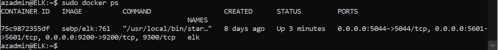

## Automated ELK Stack Deployment

The files in this repository were used to configure the network depicted below.

These files have been tested and used to generate a live ELK deployment on Azure. They can be used to either recreate the entire deployment pictured above. Alternatively, select portions of the playbook file may be used to install only certain pieces of it, such as Filebeat.

  -[filebeat-playbook.yml](Ansible/filebeat-playbook.yml)

This document contains the following details:
- Description of the Topology
- Access Policies
- ELK Configuration
  - Beats in Use
  - Machines Being Monitored
- How to Use the Ansible Build

### Description of the Topology

The main purpose of this network is to expose a load-balanced and monitored instance of DVWA, the D*mn Vulnerable Web Application.

Load balancing ensures that the application will be highly accessible, in addition to restricting traffic to the network.
- Load balancers help distribute traffic evenly across servers to mitigate DoS attacks. This allows for redundancy, should an of the VM's stop responding. In having a jump box you can easily configure rules for regulating traffic that will apply to the rest of the servers/VM's.

Integrating an ELK server allows users to easily monitor the vulnerable VMs for changes to the traffic and system files.
- Filebeat is a module that specifically collects data about the file system. 
- Metricbeat is a module that specifically collects machine metrics, e.g. Uptime.

The configuration details of each machine may be found below.

| Name     | Function | IP Address | Operating System |
|----------|----------|------------|------------------|
| Jump Box | Gateway  | 10.0.0.4   | Linux            |
| Web 1    | Server   | 10.0.0.5   | Linux            |
| Web 2    | Server   | 10.0.0.6   | Linux            |
| ELK      | Monitor  | 10.1.0.4   | Linux            |

### Access Policies

The machines on the internal network are not exposed to the public Internet. 

Only the Jump-Box-Provisioner machine can accept connections from the Internet. Access to this machine is only allowed from the following IP addresses:
- 40.88.14.48

Machines within the network can only be accessed by Jump-Box-Provisioner.
- The ELK Server can only be accesses via Jump-Box-Provisioner. 
- 10.1.0.4

A summary of the access policies in place can be found in the table below.

| Name     | Publicly Accessible | Allowed IP Addresses |
|----------|---------------------|----------------------|
| Jump Box | Yes/No              | 40.88.14.48          |
| Web 1    | No                  | 10.0.0.4             |
| Web 2    | No                  | 10.0.0.4             |
| ELK      | No                  | 10.0.0.4             |

### Elk Configuration

Ansible was used to automate configuration of the ELK machine. No configuration was performed manually, which is advantageous because as a provisioner software application, it can apply any changes made to all machines easily and very quickly. Without needing to login to a machine manually and running codes or editing config files via SSH, this makes it easier to maintain as it ensures all configurations run identically, reducing potential for human error and increased potential for horizontal scalability. There are also auditing and storage benefits, as small text files of code can be sent to a central database rather than an entire server along with it's settings. As per auditing, when code is created that contains configurations of a server, it can be version controlled. Ansible also ships with a library of modules/tools that can be written and executed remotely through the use of Playbooks, such as the [install-elk](Ansible/install-elk.yml) playbook.

The playbook implements the following tasks:
- Install's docker.io engine to VM
- Install's pip3 package to use Python software
- Install's docker which is a Python client and required for Ansible 
- Downloads Docker Container Image named sebp/elk:761
- Configures container to start with port mappings: 
  - 5601:5601
  - 9200:9200
  - 5044:5044     

The following screenshot displays the result of running `docker ps` after successfully configuring the ELK instance.

### Target Machines & Beats
This ELK server is configured to monitor the following machines:
- 10.0.0.4
- 10.0.0.5
- 10.0.0.6

We have installed the following Beats on these machines:
- Webservers: Web 1, Web 2, Jump-Box-Provisioner

These Beats allow us to collect the following information from each machine:
- Filebeat collects data about the file system such as any edits indexed in the registry, so should there be any network issues, it will pick up where it left off once the connection is re-established. 
- Metricbeat collects machine metrics, as the name suggests, such as machine uptime per days/hours.

### Using the Playbook
In order to use the playbook, you will need to have an Ansible control node already configured. Assuming you have such a control node provisioned: 

SSH into the control node and follow the steps below:
- Copy the [install-elk](Ansible/install-elk.yml) file to `/etc/ansible`. Run the `curl` option to download the file: `curl https://github.com/cybersecEdward/ELK-Stack-Startup/blob/3f8cb6487ca738068a44dbae0b22aa72476f4acd/Ansible/install-elk.yml`
- Update the `host` file located in `/etc/ansible` by using `nano` to edit and add an `[elk]` group with corresponding IP address of your control node VM. Make sure the `[elk]` group and `[webservers]` group (should include IP addresses of server VM's) are separate.
- Run the playbook, and navigate to `http://[your.ELK-VM.External.IP]:5601/app/kibana` to check that the installation worked as expected.
